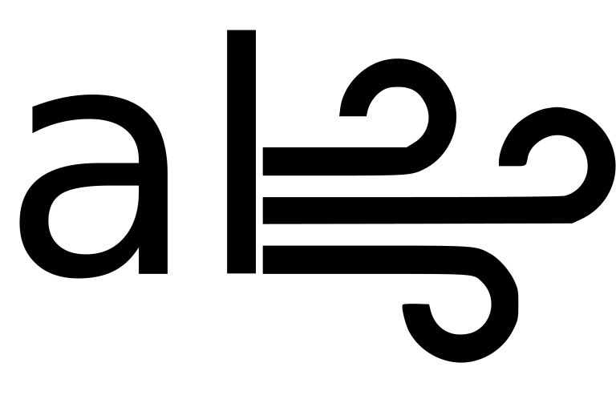

<div  align="center">

# auraloss



A collection of audio-focused loss functions in PyTorch. 

[[PDF](https://www.christiansteinmetz.com/s/DMRN15__auraloss__Audio_focused_loss_functions_in_PyTorch.pdf)]

</div>

## Setup

```
pip install auraloss
```

If you want to use `MelSTFTLoss()` or `FIRFilter()` you will need to specify the extra install (librosa and scipy).

```
pip install auraloss[all]
```

## Usage

```python
import torch
import auraloss

mrstft = auraloss.freq.MultiResolutionSTFTLoss()

input = torch.rand(8,1,44100)
target = torch.rand(8,1,44100)

loss = mrstft(input, target)
```

# Loss functions

We categorize the loss functions as either time-domain or frequency-domain approaches. 
Additionally, we include perceptual transforms.

<table>
    <tr>
        <th>Loss function</th>
        <th>Interface</th>
        <th>Reference</th>
    </tr>
    <tr>
        <td colspan="3" align="center"><b>Time domain</b></td>
    </tr>
    <tr>
        <td>Error-to-signal ratio (ESR)</td>
        <td><code>auraloss.time.ESRLoss()</code></td>
        <td><a href=https://arxiv.org/abs/1911.08922>Wright & Välimäki, 2019</a></td>
    </tr>
    <tr>
        <td>DC error (DC)</td>
        <td><code>auraloss.time.DCLoss()</code></td>
        <td><a href=https://arxiv.org/abs/1911.08922>Wright & Välimäki, 2019</a></td>
    </tr>
    <tr>
        <td>Log hyperbolic cosine (Log-cosh)</td>
        <td><code>auraloss.time.LogCoshLoss()</code></td>
        <td><a href=https://openreview.net/forum?id=rkglvsC9Ym>Chen et al., 2019</a></td>
    </tr>
    <tr>
        <td>Signal-to-noise ratio (SNR)</td>
        <td><code>auraloss.time.SNRLoss()</code></td>
        <td></td>
    </tr>
    <tr>
        <td>Scale-invariant signal-to-distortion <br>  ratio (SI-SDR)</td>
        <td><code>auraloss.time.SISDRLoss()</code></td>
        <td><a href=https://arxiv.org/abs/1811.02508>Le Roux et al., 2018</a></td>
    </tr>
    <tr>
        <td>Scale-dependent signal-to-distortion <br>  ratio (SD-SDR)</td>
        <td><code>auraloss.time.SDSDRLoss()</code></td>
        <td><a href=https://arxiv.org/abs/1811.02508>Le Roux et al., 2018</a></td>
    </tr>
    <tr>
        <td colspan="3" align="center"><b>Frequency domain</b></td>
    </tr>
    <tr>
        <td>Aggregate STFT</td>
        <td><code>auraloss.freq.STFTLoss()</code></td>
        <td><a href=https://arxiv.org/abs/1808.06719>Arik et al., 2018</a></td>
    </tr>
    <tr>
        <td>Aggregate Mel-scaled STFT</td>
        <td><code>auraloss.freq.MelSTFTLoss(sample_rate)</code></td>
        <td></td>
    </tr>
    <tr>
        <td>Multi-resolution STFT</td>
        <td><code>auraloss.freq.MultiResolutionSTFTLoss()</code></td>
        <td><a href=https://arxiv.org/abs/1910.11480>Yamamoto et al., 2019*</a></td>
    </tr>
    <tr>
        <td>Random-resolution STFT</td>
        <td><code>auraloss.freq.RandomResolutionSTFTLoss()</code></td>
        <td><a href=https://www.christiansteinmetz.com/s/DMRN15__auraloss__Audio_focused_loss_functions_in_PyTorch.pdf>Steinmetz & Reiss, 2020</a></td>
    </tr>
    <tr>
        <td>Sum and difference STFT loss</td>
        <td><code>auraloss.freq.SumAndDifferenceSTFTLoss()</code></td>
        <td><a href=https://arxiv.org/abs/2010.10291>Steinmetz et al., 2020</a></td>
    </tr>
    <tr>
        <td colspan="3" align="center"><b>Perceptual transforms</b></td>
    </tr>
    <tr>
        <td>Sum and difference signal transform</td>
        <td><code>auraloss.perceptual.SumAndDifference()</code></td>
        <td><a href=#></a></td>
    </tr>
    <tr>
        <td>FIR pre-emphasis filters</td>
        <td><code>auraloss.perceptual.FIRFilter()</code></td>
        <td><a href=https://arxiv.org/abs/1911.08922>Wright & Välimäki, 2019</a></td>
    </tr>
</table>

\* [Wang et al., 2019](https://arxiv.org/abs/1904.12088) also propose a multi-resolution spectral loss (that [Engel et al., 2020](https://arxiv.org/abs/2001.04643) follow), 
but they do not include both the log magnitude (L1 distance) and spectral convergence terms, introduced in [Arik et al., 2018](https://arxiv.org/abs/1808.0671), and then extended for the multi-resolution case in [Yamamoto et al., 2019](https://arxiv.org/abs/1910.11480).

## Examples

Currently we include an example using a set of the loss functions to train a TCN for modeling an analog dynamic range compressor. 
For details please refer to the details in [`examples/compressor`](examples/compressor). 
We provide pre-trained models, evaluation scripts to compute the metrics in the [paper](https://www.christiansteinmetz.com/s/DMRN15__auraloss__Audio_focused_loss_functions_in_PyTorch.pdf), as well as scripts to retrain models. 

There are some more advanced things you can do based upon the `STFTLoss` class. 
For example, you can compute both linear and log scaled STFT errors as in [Engel et al., 2020](https://arxiv.org/abs/2001.04643).
In this case we do not include the spectral convergence term. 
```python
stft_loss = auraloss.freq.STFTLoss(w_log_mag=1.0, 
                                   w_lin_mag=1.0, 
                                   w_sc=0.0, )
```

There is also a Mel-scaled STFT loss, which has some special requirements. 
This loss requires you set the sample rate as well as specify the correct device. 
```python
sample_rate = 44100
melstft_loss = auraloss.freq.MelSTFTLoss(sample_rate, device="cuda")
```

You can also build a multi-resolution Mel-scaled STFT loss with 64 bins easily. 
Make sure you pass the correct device where the tensors you are comparing will be. 
```python
mrmelstft_loss = auraloss.freq.MultiResolutionSTFTLoss(scale="mel", 
                                                       n_bins=64,
                                                       sample_rate=sample_rate,
                                                       device="cuda")
```

# Development

We currently have no tests, but those will also be coming soon, so use caution at the moment. 
Future loss functions to be included will target neural network based perceptual losses, 
which tend to be a bit more sophisticated than those we have included so far. 

If you are interested in adding a loss function please make a pull request. 

## Loss functions to be added
- [Spectral Energy Distance](https://arxiv.org/abs/2008.01160)
- [TFGAN Losses](https://arxiv.org/abs/2011.12206)

# Cite
If you use this code in your work please consider citing us.
```
@inproceedings{steinmetz2020auraloss,
    title={auraloss: {A}udio focused loss functions in {PyTorch}},
    author={Steinmetz, Christian J. and Reiss, Joshua D.},
    booktitle={Digital Music Research Network One-day Workshop (DMRN+15)},
    year={2020}}
```
